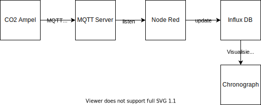

# Zentrale Datenerfassung für CO2 Ampel

Der ESP8266 hat WLAN und unterstützt verschiedene Netzwerkprotokolle. Zusätzlich zur lokalen Anzeige könnten Messwerte auch zentral gesammelt und visalisiert werden.

Idee:

- CO2Ampel wird an Schul-WLAN angebunden
- CO2 Werte werden neben der lokalen Anzeige auch als MQTT Nachricht versendet
- Mit Node Red wird ein Listener auf MQTT Nachrichten der Ampeln eingerichtet
- Für jede Nachricht werden die Daten in die Zeitreihendatenbank InfluxDB gespeichert
- Mit Chronograph können die Daten aus InfluxDB visialisiert werden

### Verbinden mit WLAN

Die Bibliothek Wifimanager ermöglicht, WLAN SSID und Passwort über ein Webconfig einzugeben. Diese werden dann im EEPROM gespeichert.
So muss die Konfiguration nur einmal gemacht werden.

https://github.com/tzapu/WiFiManager

Zusätzlich zu den Wifidaten kann man auch weitere Parameter abfragen. Z.B.: MQTT Server und topic der Ampel.

### Senden der Daten per MQTT

PubSubClient ermöglicht senden und empfangen von MQTT Nachrichten.
Im Beispiel wird der Verbindungsaufbau in setup gamacht. Besser wäre noch, den Verbingungsaufbau asynchron im loop zu machen. 
Damit startet das System schneller und kann bei Verbindungsabbruch auch neu connecten.
